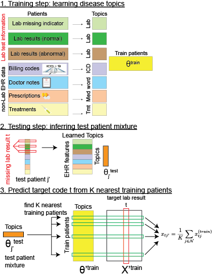
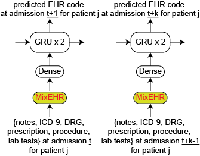

# MixEHR: Multi-modal Mixture Topic Model for mining EHR data

 

**MixEHR model overview**. **a.** Multi-view matrix factorization of multiple data matrices corresponding to different EHR data types including lab tests, billing code, doctor notes, etc. **b.** Proposed Bayesian model for modeling non-missing at random (NMAR) lab tests and other multimodal data. In order to achieve tractable inference, we assign a latent topic h_lj to the lab results y_lj and missing indicator (r_lj) such that they become conditionally independent. **c.** Collapsed variational Bayesian inference of the MixEHR model. The inference and learning can be visualized as marginalizing a 3-dimensional tensor that represents the expectations of the latent variables.


MixEHR is a Unix-style command-line tool. You can compile it on a unix machine. 

## INSTALLATION:

To install MixEHR, you will need to first install armadillo (http://arma.sourceforge.net)

Assuming you are in the mixehr directory, to compile, simply run:
```
make
```

To test whether ‘mixehr’ can run, do: 
```
mixehr -h
```
This should output:
```
./mixehr -f examples/toydata.txt -m1 examples/toymeta_phe.txt -i 10 -k 10
```

See scripts mixmimic.sh for training on MIMIC data

We included the MIMIC-III data. To run mixehr, you will need a meta data file that contains 3 columns: 

1. typeId: indicates distinct data types such as ICD-9, lab test, etc with 1, 2, etc
2. pheId: indicate the phenotype ID (e.g., lab test 1, lab test 2, etc)
3. stateCnt: indicate the number of states for the phenotype. This is designed for lab test at the moment, but will work for other data types with discrete states.

See the example file ‘mixmimic/mimic_meta.txt’ in the folder.

The actual EHR data file (mixmimic/mimic_trainData.txt) has 5 columns rows:

1. Patient ID
2. typeId (concurring the meta file above)
3. pheId (concurring the meta file above)
4. stateId (zero-based, and set to 1 for binary feature and starting 0 onwards for discrete lab values)
5. freq (number of times observed at least 1)

NOTE: stateId must be incremental and start from 0. That is no skipping number. 

## Training and validation
The main training command:
```
./mixehr -f $ehrdata -m $ehrmeta -k $K -i $niter \
	--inferenceMethod JCVB0 --maxcores 8 \
	--outputIntermediates 
```

Flags are:

-f: ehr data file;
-m: meta file
-i: number of iterations
-k: number of meta-phenotypes
-n: inference method (JCVB0 or SCVB0 for stochastic)
--maxcores: maximum number of CPU cores to use
--outputIntermediates: (whether output intermediate learned parameters for inspection)

If you have a test data for producing predictive likelihood, then you can run the same command with added flag '-t $testdata', where the test data contain the same format as the training data but contain one extra column in the end indicating whether the feature is missing (0) or observed (1). See mixmimic_sim folder for the simulated data as examples.


## Infer new patient mixture
See mixmimic_testpat.sh

After you train the model, you will find a CSV file mimic_trainData_JCVB0_iter500_phi_normalized. The first two columns are typeId and pheId (concurring the IDs in the above meta file mimic_meta.txt). The rest of the columns are normalized probabilities for the membership of each phenotype. Similar phenotypes tend to exhibit high probabilities under the same column (i.e., meta-phenotype). mimic_trainData_JCVB0_iter500_eta_normalized is similar but with the first 3 columns, indicating typeId, labId, stateId and the rest are K columns probabilities.


Command to infer disease mixture of new patients:
```
mixehr -m $ehrmeta -n JCVB0 --newPatsData $testdata \
        --trainedModelPrefix $trainedPrefix -k $K --inferNewPatentMetaphe \
        --inferPatParams_maxiter 100
```
This gives a D by K matrix file (*_metaphe.csv), which is the normalized probabilities (row sum is one) for D test patients for K meta-phenotypes.

These inferred disease mixtures can then be used as patient representations to train classifiers for specific tasks. For example, a linear classifier (such as Logistic Regression or Elastic Net) can be used to predict mortality given these patient representations as input. 

## Application 1: Prediction of mortality using patient topic mixture memberships:
One way to interpret the mortality prediction results and the topic mixtures is to calculate the correlation between the mortaltiy labels and each of the topics. The topics most positively and negatively correlated with mortality can be visualized as heat maps. To do so, we make use of the file with the suffix  `_phi_normalised.csv` that is obtained after training MixEHR. This file contains an N by K matrix file which is the normalized probabilities (column sum is one) for N features for K meta-phenotypes (topics). For each of the K topics, the top features can be obtained from the feature IDs given in [mixmimic/ehrFeatId.Rdata](mixmimic/ehrFeatId.RData). 

A heatmap of these features can then be plotted whose intensity is given by the probability values. Below is an example of the top 5 EHR codes (features) associated with the top 3 topics positively correlated and the bottom 3 topics negatively correlated with mortality indicated by blue and green respectively. The categories of the features are indicated by the colour map presented beside the heatmap. The intensity of the red colour indicates the probability of a particular feature belonging to a particular topic. 


## Application 2: Retrospective Prediction of EHR code:


To impute missing data in an individual-specific way, we here describe a k-nearest neighbour approach. The prediction can be divided into 3 steps:

1. Train MixEHR on training set to learn the EHR-code by disease topic matrices **W** across data types and infer the disease topic mixtures $\theta^{train}$ for each training patient data point;
2. To infer the probability of an unknown EHR code $t$ for a test patient $j'$, use MixEHR and the learnt disease topic matrices $\mf{W}$ to infer the disease topic mixture $\theta_{j'}$ for the test patient;
3. Compare the test patient disease topic mixture $\theta_{j'}$ with the training patient disease mixtures $\theta^{train}$ to find the $k$ most similar training patients $\mathcal{S}_{j'}$. Here the patient-patient similarity matrix is calculated based on the Euclidean distance between their disease topic mixtures:

Finally, we take the average of the EHR code t over these k-nearest neighbour patients as the prediction for the target code $t$ for test patient j'. We empirically determined the number of nearest neighbours $k$ to be 100.


TO-DO: example


## Application 3: Imputing missing lab results:


**Workflow to impute lab results.** This is similar to the retrospective EHR code prediction. **Step 1.** We modeled lab tests, lab test results and non-lab EHR data (i.e., ICD, notes, prescription, treatment) to infer the patient topic mixture. **Step 2.** For a test patient, we masked each of his observed lab test result t and inferred his topic mixture. **Step 3.** We then found k=25 (by default) patients who have the lab test results $t$ observed and exhibit the most similar topic mixture to the test patient. We then took the average of lab result values over the k patients as the prediction of the lab result value for the test patient j'. Steps 1-3 were repeated to evaluate every observed lab test in every test patient.

Please download and unzip this file: 

Here the mimic_data_train_pat_mix_50.csv that can be generated from using above approach described in **Infer new patient mixture**. The mimic_data_train_JCVB0_nmar_K50_iter1000*.csv are the trained model parameters that can be generated from **Training and validation** section.

Then run the following command:

```
k=50
iter=1000

./mixehr --metaFile lab_imputation/mimic_meta.txt --topics $k \
        --trainDataFile lab_imputation/mimic_data_train.txt \
        --imputeTargetsFile lab_imputation/impute_target_labId.txt \
        --imputePatDataFile lab_imputation/mimic_data_test.txt \
        --trainPatMetapheFile lab_imputation/mimic_data_train_pat_mix_${k}.csv \
        --trainPatIdFile lab_imputation/mimic_data_train_pat_mix_${k}_patId.csv \
        --knn_impute 25 \
        --output_dir lab_imputation/mimic_data_test_pat_impute_lab_K${k} \
        --trainedModelPrefix lab_imputation/mimic_data_train_JCVB0_nmar_K${k}_iter$iter
```        


## Application 4: Prediction of longitudinal EHR code:


To predict dynamic or longitudinal EHR code, we describe a novel pipeline that combines MixEHR topics with recurrent neural network (RNN) with Gated Recurrent Unit (GRU). We first trained MixEHR on the EHR data for 39,000 patients with single-admission in MIMIC-III. We then used the trained MixEHR to infer topic mixture at each admission for the 7541 patients with multiple admissions. Then we used as input the inferred topic mixture at the current admission (say at time t) to the RNN to autoregressively predict the diagnostic codes at the next admission at time t+1. Here \mxr~uses all of the data types from MIMIC-III. More details on the architecture of the neural networks are described in our paper (under peer review).

TO-DO: code example


