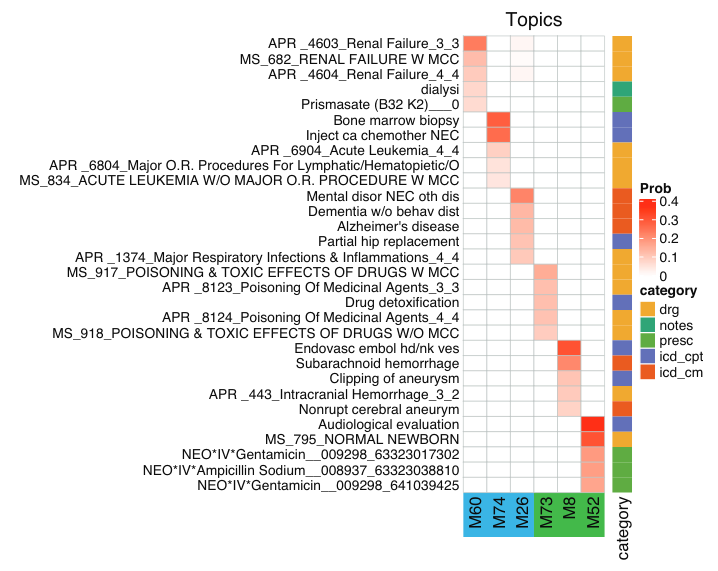

# MixEHR: Multi-modal Mixture Topic Model for mining EHR data

 

**MixEHR model overview**. **a.** Multi-view matrix factorization of multiple data matrices corresponding to different EHR data types including lab tests, billing code, doctor notes, etc. **b.** Proposed Bayesian model for modeling non-missing at random (NMAR) lab tests and other multimodal data. In order to achieve tractable inference, we assign a latent topic h_lj to the lab results y_lj and missing indicator (r_lj) such that they become conditionally independent. **c.** Collapsed variational Bayesian inference of the MixEHR model. The inference and learning can be visualized as marginalizing a 3-dimensional tensor that represents the expectations of the latent variables.


MixEHR is a Unix-style command-line tool. You can compile it on a unix machine. 

## INSTALLATION:

To install MixEHR, you will need to first install armadillo (http://arma.sourceforge.net)

Assuming you are in the mixehr directory, to compile, simply run:
```
make
```

To test whether ‘mixehr’ can run, do: 
```
mixehr -h
```
This should output:
```
./mixehr -f examples/toydata.txt -m1 examples/toymeta_phe.txt -i 10 -k 10
```

See scripts mixmimic.sh for training on MIMIC data

We included the MIMIC-III data. To run mixehr, you will need a meta data file that contains 3 columns: 

1. typeId: indicates distinct data types such as ICD-9, lab test, etc with 1, 2, etc
2. pheId: indicate the phenotype ID (e.g., lab test 1, lab test 2, etc)
3. stateCnt: indicate the number of states for the phenotype. This is designed for lab test at the moment, but will work for other data types with discrete states.

See the example file ‘mixmimic/mimic_meta.txt’ in the folder.

The actual EHR data file (mixmimic/mimic_trainData.txt) has 5 columns rows:

1. Patient ID
2. typeId (concurring the meta file above)
3. pheId (concurring the meta file above)
4. stateId (zero-based, and set to 1 for binary feature and starting 0 onwards for discrete lab values)
5. freq (number of times observed at least 1)

NOTE: stateId must be incremental and start from 0. That is no skipping number. 

## Training and validation
The main training command:
```
./mixehr -f $ehrdata -m $ehrmeta -k $K -i $niter --inferenceMethod JCVB0 --maxcores 8 --outputIntermediates 
```

Flags are:

-f: ehr data file;
-m: meta file
-i: number of iterations
-k: number of meta-phenotypes
-n: inference method (JCVB0 or SCVB0 for stochastic)
--maxcores: maximum number of CPU cores to use
--outputIntermediates: (whether output intermediate learned parameters for inspection)

If you have a test data for producing predictive likelihood, then you can run the same command with added flag '-t $testdata', where the test data contain the same format as the training data but contain one extra column in the end indicating whether the feature is missing (0) or observed (1). See mixmimic_sim folder for the simulated data as examples.


## Infer new patient mixture
See mixmimic_testpat.sh

After you train the model, you will find a CSV file mimic_trainData_JCVB0_iter500_phi_normalized. The first two columns are typeId and pheId (concurring the IDs in the above meta file mimic_meta.txt). The rest of the columns are normalized probabilities for the membership of each phenotype. Similar phenotypes tend to exhibit high probabilities under the same column (i.e., meta-phenotype). mimic_trainData_JCVB0_iter500_eta_normalized is similar but with the first 3 columns, indicating typeId, labId, stateId and the rest are K columns probabilities.


Command to infer disease mixture of new patients:
```
mixehr -m $ehrmeta -n JCVB0 --newPatsData $testdata \
        --trainedModelPrefix $trainedPrefix -k $K --inferNewPatentMetaphe \
        --inferPatParams_maxiter 100
```
This gives a D by K matrix file (*_metaphe.csv), which is the normalized probabilities (row sum is one) for D test patients for K meta-phenotypes.

These inferred disease mixtures can then be used as patient representations to train classifiers for specific tasks. For example, a linear classifier (such as Logistic Regression or Elastic Net) can be used to predict mortality given these patient representations as input. 


One way to interpret the mortality prediction results and the topic mixtures is to calculate the correlation between the mortaltiy labels and each of the topics. The topics most positively and negatively correlated with mortality can be visualized as heat maps. To do so, we make use of the file with the suffix  `_phi_normalised.csv` that is obtained after training MixEHR. This file contains an N by K matrix file which is the normalized probabilities (column sum is one) for N features for K meta-phenotypes (topics). For each of the K topics, the top features can be obtained from the feature IDs given in [mixmimic/ehrFeatId.Rdata](mixmimic/ehrFeatId.RData). A heatmap of these features can then be plotted whose intensity is given by the probability values. Below is an example of the top 5 EHR codes (features) associated with the top 3 topics positively correlated and the bottom 3 topics negatively correlated with mortality indicated by blue and green respectively. The categories of the features are indicated by the colour map presented beside the heatmap. The intensity of the red colour indicates the probability of a particular feature belonging to a particular topic. 




## Application 1: Retrospective Prediction of EHR code:
TO-DO

## Application 2: Prediction of longitudinal EHR code:
TO-DO


## Application 3: Prediction a phenotype of interest using patient topic mixture memberships:
TO-DO


## Application 4: Imputing missing lab results:
TO-DO


