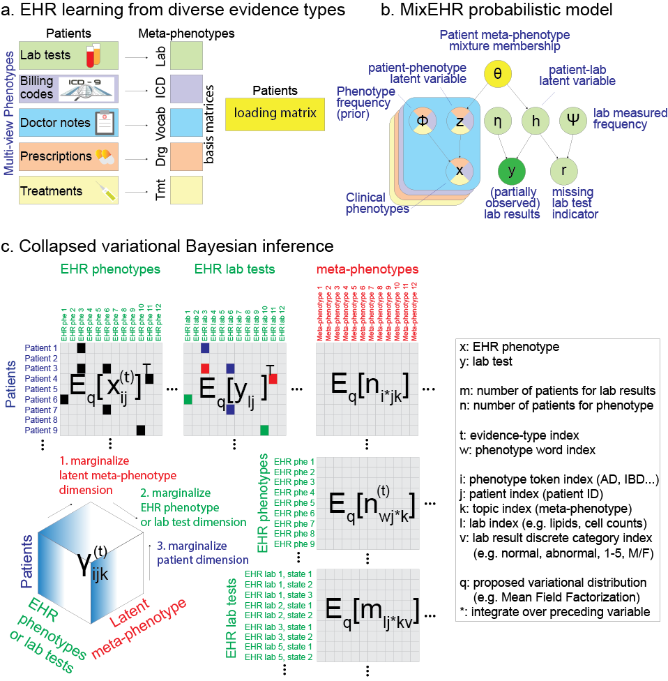

MixEHR

MixEHR is a Unix-style command-line tool. You can compile it on a unix machine. 

**Multi-modal topic model for mining EHR data** 

INSTALLATION:

To install MixEHR, you will need to first install armadillo (http://arma.sourceforge.net)

Assuming you are in the mixehr directory, to compile, simply run:

make

To test whether ‘mixehr’ can run, do: 

mixehr -h

See scripts mixmimic.sh for training on MIMIC data

We included the MIMIC-III data. To run mixehr, you will need a meta data file that contains 3 columns: 

typeId: indicates distinct data types such as ICD-9, lab test, etc with 1, 2, etc
pheId: indicate the phenotype ID (e.g., lab test 1, lab test 2, etc)
stateCnt: indicate the number of states for the phenotype. This is designed for lab test at the moment, but will work for other data types with discrete states.

See the example file ‘mixmimic/mimic_meta.txt’ in the folder.

The actual EHR data file (mixmimic/mimic_trainData.txt) has 5 columns rows:

Patient ID
typeId (concurring the meta file above)
pheId (concurring the meta file above)
stateId (zero-based, and set to 1 for binary feature and starting 0 onwards for discrete lab values)
freq (number of times observed at least 1)

NOTE: All IDs must be incremental and start from 1. That is no skipping number. 

#### training and validation ####
The main training command:
./mixehr -f $ehrdata -m $ehrmeta -k $K -i $niter --inferenceMethod JCVB0 --maxcores 8 --outputIntermediates 

Flags are:

-f: ehr data file;
-m: meta file
-i: number of iterations
-k: number of meta-phenotypes
-n: inference method (JCVB0 or SCVB0 for stochastic)
--maxcores: maximum number of CPU cores to use
--outputIntermediates: (whether output intermediate learned parameters for inspection)

If you have a test data for producing predictive likelihood, then you can run the same command with added flag '-t $testdata', where the test data contain the same format as the training data but contain one extra column in the end indicating whether the feature is missing (0) or observed (1). See mixmimic_sim folder for the simulated data as examples.

#### infer new patient mixture ####
See mixmimic_testpat.sh

After you train the model, you will find a CSV file mimic_trainData_JCVB0_iter500_phi_normalized. The first two columns are typeId and pheId (concurring the IDs in the above meta file mimic_meta.txt). The rest of the columns are normalized probabilities for the membership of each phenotype. Similar phenotypes tend to exhibit high probabilities under the same column (i.e., meta-phenotype). mimic_trainData_JCVB0_iter500_eta_normalized is similar but with the first 3 columns, indicating typeId, labId, stateId and the rest are K columns probabilities.

Command to infer disease mixture of new patients:

mixehr -m $ehrmeta -n JCVB0 --newPatsData $testdata \
        --trainedModelPrefix $trainedPrefix -k $K --inferNewPatentMetaphe \
        --inferPatParams_maxiter 100

This gives a D by K matrix file (*_metaphe.csv), which is the normalized probabilities (row sum is one) for D test patients for K meta-phenotypes.

